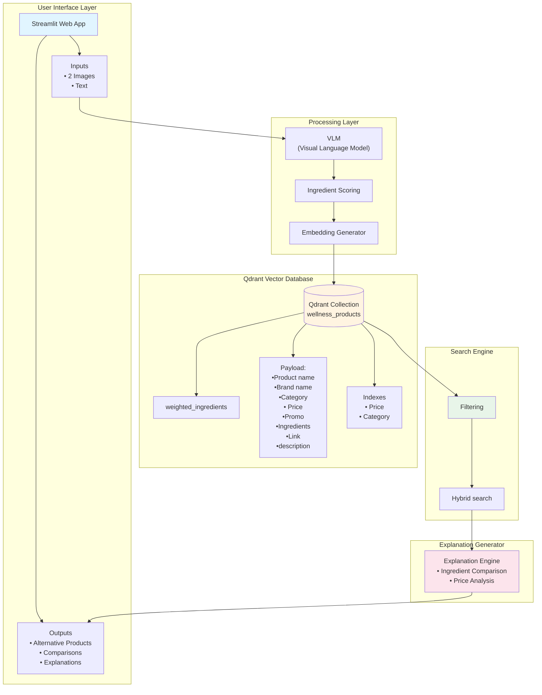

# ParaSave: Wellness products recommendation
## 🔍 Project Overview

**ParaSave** consults you on the wellness product alternatives you should buy. Upload two photos and tell us about your preference. We'll find you safer, smarter, cheaper options.

### How It Works

**Inputs:**
1. **Photo of the product** - Shows the product name, brand... (usually the front) 📸
2. **Photo of the ingredients list** - The detailed ingredient label (usually on the back) 📸
3. **Budget** 📊

**Outputs:**
- **Alternative products** that match the original's effectiveness
- Detailed explanations for each recommendation

---

## 🎯 Objectives

**ParaSave** addresses critical gaps in wellness product shopping:
- **Ingredient Intelligence** - Understand complex ingredient lists and identify what actually matters
- **Budget Optimization** - Find cheaper alternatives with the same active ingredients
- **Transparent Recommendations** - Explain why each alternative works through clear
---

## 🛠️ Technologies Used

### **Core Development**
- **Python** `3.8.10` - Primary programming language

### **Data Collection & Processing**
- **Selenium** - Web scraping automation
- **BeautifulSoup** - HTML parsing and data extraction
- **Data Storage Formats**: JSON and `.pkl` (pickle)

### **AI & Machine Learning**
- **Groq API** - Vision-Language Model inference
  - Model: `meta-llama/llama-4-scout-17b-16e-instruct`
- **sentence-transformers** - Text embeddings
  - Model: `paraphrase-multilingual-MiniLM-L12-v2`
  - Embedding dimension: 384

### **Vector Database**
- **Qdrant Cloud** - Managed vector similarity search engine
- **qdrant-client** - Python client for Qdrant operations

### **Frontend**
- **Streamlit** `1.22.0` - Web application framework

## Architecture

